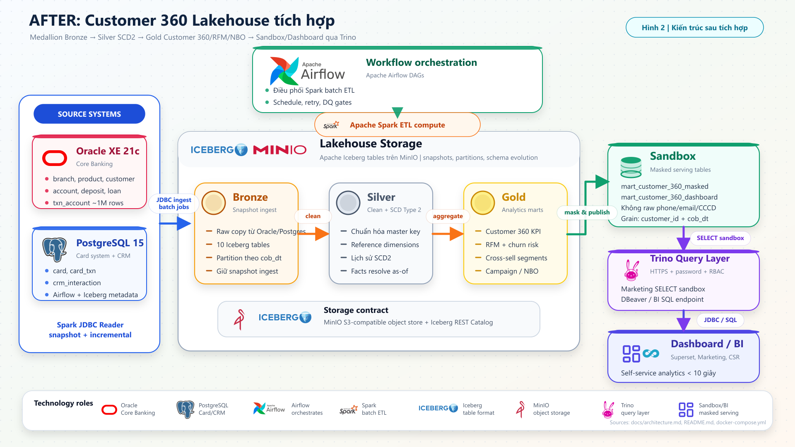
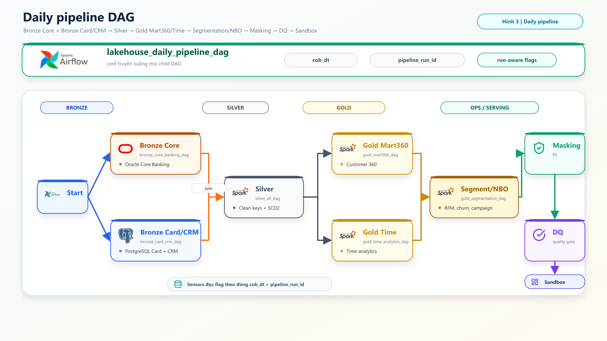
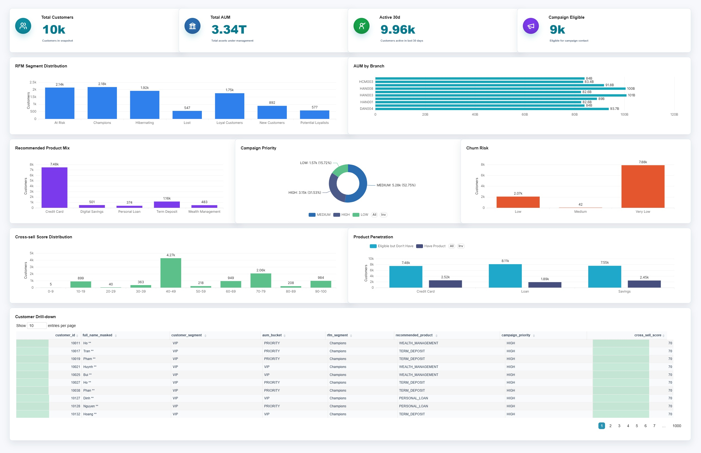

# Customer 360 Lakehouse for Retail Banking

Customer 360 Lakehouse is a Docker-based retail banking data platform for Customer 360 analytics. It integrates customer, account, card, CRM, transaction, branch, and product data into curated Lakehouse layers for segmentation, campaign targeting, and customer follow-up.

Main use case: Marketing/CRM can find customers for credit cards, deposits, personal loans, or wealth management without waiting for manual extraction across separate systems. The serving layer exposes governed SQL tables and Superset dashboard views.

## 1. Business Context

In many retail banks, customer data lives across several operational systems:

- Core Banking holds customers, accounts, deposits, loans, products, branches, and account transactions.
- Card and CRM systems hold card transactions, campaign history, customer interactions, and consent signals.
- Business teams need a unified view, but raw data often contains sensitive fields such as names, phone numbers, national IDs, and email addresses.

The workflow lands source data into Bronze, standardizes it through Silver, builds Gold marts with historical changes, and publishes masked tables to Sandbox. Marketing access goes through Trino/Superset on sandbox tables only; raw PII stays outside the business-facing layer.

## 2. Project Structure

```text
lakehouse_etl/
|-- airflow/                    # DAGs and plugins for ETL orchestration
|-- code_etl/                   # Spark ETL jobs for Bronze, Silver, Gold, and ops
|-- data_generator/             # Simulated source data for Oracle/PostgreSQL
|-- ddl/                        # Source and Lakehouse DDL
|-- docker/                     # Docker Compose, image config, init scripts, Superset
|-- exports/                    # CSV exports for comparison or demos
|-- image/                      # Architecture, pipeline, and dashboard images
|-- notebooks/                  # Acceptance and interactive testing notebooks
|-- sql_templates/trino/        # Business queries and check SQL
|-- tests/                      # Static contract tests and integration tests
|-- README.md
`-- RUN_FROM_SCRATCH_GUIDE.md
```

## 3. Data Set

The demo data is synthetic and deterministic. The generator uses `seed: 42`, a baseline `cob_dt` of `2025-12-31`, and 12 months of transaction history. The day-2 flow uses `2026-01-01` after controlled source changes for SCD2 and history checks.

Source coverage:

- **Oracle `core_banking`**: `branch`, `product`, `customer`, `account`, `deposit`, `loan`, `txn_account`.
- **PostgreSQL `card_crm`**: `card`, `card_txn`, `crm_interaction`.

Configured data volume:

| Source | Entity / table | Rows | Notes |
|---|---|---:|---|
| Oracle | Branches | 50 | Distributed across North, Central, and South regions |
| Oracle | Products | 16 | CASA, savings, loan, credit card, and debit card products |
| Oracle | Customers | 10,000 | 70% Retail, 25% Priority, 5% VIP |
| Oracle | Accounts | 13,500 | 10,000 CASA accounts and 3,500 time-deposit accounts |
| Oracle | Deposits | 3,500 | One deposit record per time-deposit account |
| Oracle | Loans | 2,700 | Segment-based loan penetration |
| Oracle | Account transactions | 1,050,000 | 12 months of CASA transaction history |
| PostgreSQL | Cards | 10,000 | One card per customer; credit card when eligible, debit card otherwise |
| PostgreSQL | Card transactions | 212,400 | 12 months of credit-card transaction history |
| PostgreSQL | CRM interactions | 10,000 | Calls, emails, chats, branch visits, and SMS interactions |

The source layer includes synthetic PII fields such as name, phone, email, national ID, and address. Sandbox tables expose masked fields only.

## 4. Product Flow

The medallion flow is:

- **Bronze** stores source-aligned data from Oracle and PostgreSQL by `cob_dt`.
- **Silver** standardizes keys, cleans dimensions, applies SCD Type 2 to `customer`, `account`, `product`, and `branch`, and resolves facts against the correct historical dimension versions.
- **Gold** builds the Customer 360 mart, daily Customer 360 history, RFM segments, churn risk, cross-sell segments, branch/time analytics, and campaign targeting outputs.
- **Sandbox** publishes business-facing tables with masked PII and a stable contract for dashboard usage.
- **Trino + RBAC** gives Marketing read access to the sandbox while keeping sensitive Gold tables restricted.
- **Airflow** orchestrates daily runs with `cob_dt` and `pipeline_run_id`, so each run can be traced and checked.

The serving layer is reusable for daily Customer 360 use cases rather than a one-time extract.

## 5. Integrated Architecture



The source systems are simulated with Oracle XE 21c for Core Banking and PostgreSQL 15 for Card/CRM data. Spark reads both sources through JDBC and writes Iceberg tables on MinIO. Data then flows from Bronze to Silver, Gold, and finally Sandbox.

Trino sits on top as the query layer. Users can connect through SQL clients or BI tools. The `marketing` role reads only from the masked sandbox, which keeps the business experience close to a real banking environment while protecting sensitive source fields.

## 6. Daily Pipeline



A daily run starts with two Bronze branches: Core Banking and Card/CRM. Once both branches finish, Silver standardizes dimensions and facts. Gold then builds the Customer 360 mart and time analytics. Segmentation, Next Best Offer rules, masking, and Data Quality checks run before data is published to the sandbox.

Operational characteristics:

- Data moves forward only after upstream steps complete.
- Every run is tied to a `cob_dt` and `pipeline_run_id`.
- Data Quality checks act as the final gate before dashboard consumption.

## 7. Business Output

After the pipeline runs, a common Marketing question becomes a direct sandbox query:

```sql
SELECT
    customer_id,
    full_name_masked,
    primary_branch_code,
    customer_segment,
    ROUND(aum_total / 1000000, 1) AS aum_million_vnd,
    rfm_segment,
    days_since_last_txn
FROM lakehouse.sandbox.mart_customer_360_masked
WHERE has_credit_card = 0
  AND aum_total > 100000000
  AND rfm_segment IN ('Champions', 'Loyal Customers')
  AND days_since_last_txn <= 30
  AND primary_branch_code LIKE 'HCM%'
ORDER BY aum_total DESC
LIMIT 1000;
```

Before the Lakehouse, this kind of request usually required a manual extract across teams. With the sandbox mart, it becomes a self-service query: Marketing sees masked names, customer segment, AUM, RFM group, and recent activity without touching raw PII.

## 8. Customer 360 Dashboard



The Superset dashboard is the main business-facing view of the pipeline. The demo snapshot contains 10,000 customers, around 3.34T total AUM, 9.96k customers active in the last 30 days, and around 9k customers eligible for campaign contact.

Key dashboard views:

- **Customer base**: 10k customers in the snapshot, with one serving-row per `customer_id + cob_dt`.
- **Recent activity**: 9.96k active customers in the last 30 days, giving enough transaction depth for RFM, churn, and campaign scoring.
- **RFM segments**: `Champions`, `At Risk`, `Hibernating`, and `Loyal Customers` are visible at scale, supporting both cross-sell and retention use cases.
- **AUM by branch**: top branches sit around 82B to 101B, making regional comparison and branch prioritization easier.
- **Recommended product mix**: Credit Card is the largest recommendation group with around 7.48k customers, followed by Term Deposit, Digital Savings, Wealth Management, and Personal Loan.
- **Campaign priority**: about 3.15k customers are `HIGH`, 5.28k are `MEDIUM`, and 1.57k are `LOW`, helping CRM teams plan contact capacity.
- **Churn risk**: most customers are `Very Low`, with smaller `Low` and `Medium` groups to monitor.
- **Product penetration**: the dashboard highlights product gaps, such as eligible customers who do not yet have Credit Card, Loan, or Savings products.
- **Customer drill-down**: the final table moves from portfolio-level metrics to individual customers using only sandbox-safe fields such as `full_name_masked`.

## 9. Implemented Scope

The current scope includes:

- 10 simulated source tables across Oracle and PostgreSQL.
- 4 SCD Type 2 dimensions for customer, account, product, and branch.
- Current Gold Customer 360 mart with one row per customer.
- Daily Gold Customer 360 history for snapshot comparison.
- RFM, churn risk, cross-sell, and rule-based Next Best Offer logic.
- Sandbox dashboard serving table at `customer_id + cob_dt` grain.
- 19 Data Quality checks covering uniqueness, SCD2 ranges, reconciliation, NBO contract, population matching, and raw PII exposure.
- Trino HTTPS/password/RBAC separation between `marketing` and `data_engineer`.
- Superset dashboard provisioned by script and backed by `lakehouse.sandbox.mart_customer_360_dashboard`.

## 10. Technology Stack

| Layer | Technology | Version |
|---|---|---|
| Source DB | Oracle XE | 21c |
| Source DB | PostgreSQL | 15 |
| Object Storage | MinIO | RELEASE.2025-09-07 |
| Table Format | Apache Iceberg | 1.4.3 |
| Compute | Apache Spark | 3.5.0 |
| Query Engine | Trino | 481 |
| Orchestration | Apache Airflow | 2.10.0 |
| BI | Apache Superset | 6.0.0 |
| Notebook | JupyterLab | 4.3.8 |
| Runtime | Docker Compose | v2 |

## 11. Quick Start

Short local setup summary. The full step-by-step guide is in [RUN_FROM_SCRATCH_GUIDE.md](RUN_FROM_SCRATCH_GUIDE.md).

Recommended requirements:

- Docker Desktop or Docker Engine with Docker Compose v2.
- At least 16GB host RAM, with around 10GB or more allocated to Docker.
- Python 3.10+ for the data generator.
- At least 20GB free disk space.

From this project directory:

Runtime config files are intentionally not submitted to Git. If `docker/.env` or `data_generator/config.yaml` already exists on the local machine, keep it and only check that all required values are filled in. If either file is missing, create it from the example file:

```powershell
if (-not (Test-Path docker\.env)) {
  Copy-Item docker\.env.example docker\.env
}

if (-not (Test-Path data_generator\config.yaml)) {
  Copy-Item data_generator\config.example.yaml data_generator\config.yaml
}
```

Then open `docker/.env` and replace every `CHANGE_ME` value. Open `data_generator/config.yaml` and make sure the Oracle/PostgreSQL passwords match `docker/.env`.

```powershell
docker compose -f docker/docker-compose.yml build
docker compose -f docker/docker-compose.yml up -d
```

After Oracle is ready, generate source data:

```powershell
cd data_generator
python -m venv .venv
.\.venv\Scripts\Activate.ps1
python -m pip install -r requirements.txt
python run_sql_gen.py
cd ..
```

The next steps are Airflow connections, Iceberg table initialization, baseline run for `2025-12-31`, day-2 run for `2026-01-01`, Data Quality checks, and Superset dashboard creation. Follow the full guide to keep `cob_dt` and `pipeline_run_id` aligned.

Main local services:

| Service | URL |
|---|---|
| Airflow | http://localhost:8080 |
| JupyterLab | http://localhost:8888 |
| Spark Master UI | http://localhost:9090 |
| MinIO Console | http://localhost:9001 |
| Trino HTTPS | https://localhost:8085 |
| Superset, optional | http://localhost:8088 |

## 12. Related Documents

- [RUN_FROM_SCRATCH_GUIDE.md](RUN_FROM_SCRATCH_GUIDE.md): full rebuild guide from a clean local environment.
- [docker/superset/README.md](docker/superset/README.md): Superset setup and automated dashboard creation.
- [notebooks/README.md](notebooks/README.md): notes for the acceptance notebooks.
- [sql_templates/trino](sql_templates/trino): business queries and check scripts.

## 13. Contact

For questions or feedback, contact <vpqcuong@gmail.com>.
